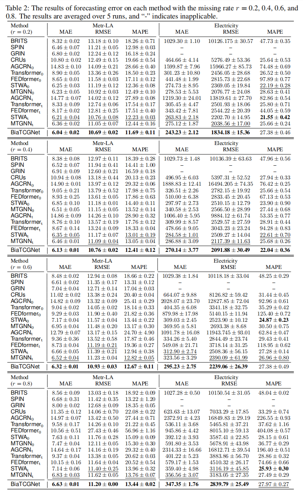

# BiTGraph
The code for Biased Temporal Convolution Graph Network for Time Series Forecasting with Missing Values. 

Biased Temporal Convolution Graph Network jointly captures the temporal dependencies and spatial structure. In particular, we inject bias into the two carefully developed modules—the Multi Scale Instance PartialTCN and Biased GCN—to account for missing patterns.

## Overview
||
|:--:| 
| *Figure 1-a Overall structure of BiTGraph, Figure 1-b the structure of Biased GCN module.* |

## Main Results
||
|:--:| 
| *Figure 2 main results.* |

## Get Started

1. Install Python>=3.8, PyTorch 1.8.0.
2. Download data.
3. Train the model.
   python main.py --epochs 200 --mask_ratio 0.2
4. Test the model.
   python test_forecasting.py --epochs 200 --mask_ratio 0.2

